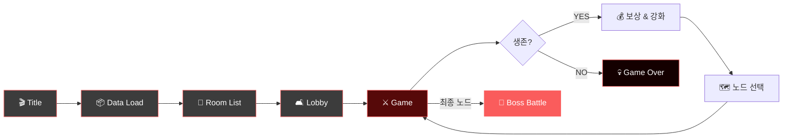

# 🧟 ZIPPERS

### *Co-op Zombie Survival Action in a Ruined City*

**Survive. Upgrade. Push Forward.**

[**🎮 Play on itch.io**](https://devel-rocket.itch.io/zippers) · [**📥 Download**](https://devel-rocket.itch.io/zippers) · [**🐛 Report Bug**](../../issues)

---

## 📑 목차

- [게임 소개](#-게임-소개)
- [핵심 특징](#️-핵심-특징)
- [게임플레이 흐름](#-게임플레이-흐름)
- [기술 스택](#️-기술-스택)
- [개발팀](#-개발팀)
- [담당 업무](#️-담당-업무)
  - [좀비](#1-좀비)
  - [웨이브](#2-웨이브-시스템)
- [프로젝트 회고](#-프로젝트-회고)
- [조작법](#-조작법)

---

## 📖 게임 소개

**Zippers**는 좀비 아포칼립스로 붕괴된 도시를 배경으로 한 **1-4인 협동 로그라이크 슈팅 게임**이다.

플레이어는 서로 다른 전투 역할을 가진 생존자가 되어 몰려오는 좀비 웨이브를 막아내고, 전투 보상으로 캐릭터를 강화하며 다음 전투 노드로 나아가야 한다. 제한된 자원, 점점 강해지는 좀비, 그리고 팀원 간의 역할 분담이 생존의 핵심이다.

---

## ⚔️ 핵심 특징

<table>
<tr>
<td width="50%" valign="top">

### 🧟 좀비 아포칼립스
붕괴된 도시를 배경으로 한 몰입감 있는 3D 액션 전투

</td>
<td width="50%" valign="top">

### 🤝 1-4인 협동 플레이
Unity Netcode 기반의 안정적인 멀티플레이어 경험

</td>
</tr>
<tr>
<td width="50%" valign="top">

### 🎯 4종 클래스 시스템
근접 / 라이플 / 샷건 / 피스톨 — 서로 다른 전투 스타일

</td>
<td width="50%" valign="top">

### 🌊 웨이브 기반 전투
점점 강해지는 좀비 무리를 끝까지 막아내라

</td>
</tr>
<tr>
<td width="50%" valign="top">

### 🗺️ 노드 선택 진행
원하는 길을 선택하며 나아가는 로그라이크식 스테이지

</td>
<td width="50%" valign="top">

### 💰 팀 재화 & 상점
협동 성장을 위한 공유 재화 시스템과 업그레이드 상점

</td>
</tr>
</table>

---

## 🎭 클래스

> 각 클래스는 고유한 전투 스타일과 역할을 가집니다. 팀의 구성에 따라 전략이 달라집니다.

| 클래스 | 역할 | 전투 스타일 |
| :---: | :--- | :--- |
| 🗡️ **Melee** | 높은 체력과 근접 전투에 특화된 생존자 | 탱커 / 근접 딜러 |
| 🔫 **Rifle** | 안정적인 사거리와 연사력을 가진 원거리 전투원 | 메인 딜러 |
| 💥 **Shotgun** | 강력한 근거리 화력으로 무리를 정리하는 클래스 | 근중거리 폭딜 |
| 🎯 **Pistol** | 뛰어난 유틸 능력으로 팀원을 보조하는 클래스 | 서포터 / 유틸 |

> 클래스 프리팹은 `Assets/Resources/Player/Class/` 에서 관리됩니다.

---

## 🔁 게임플레이 흐름

**Core Loop**: 웨이브 방어 → 전투 보상 → 캐릭터 강화 → 노드 선택 → 다음 전투 → ... → 보스

---

## 🛠️ 기술 스택

| 분류 | 사용 기술 |
| :--- | :--- |
| **엔진** | Unity 6 (6000.3.9f1) + URP 17.3 |
| **네트워킹** | Unity Netcode for GameObjects 2.11 |
| **매치메이킹** | Unity Services Multiplayer (Relay / Lobby) |
| **입력** | Unity Input System |
| **AI** | Unity AI Navigation |
| **데이터** | Newtonsoft JSON + Custom Data Pipeline |

---

## 👥 개발팀

| 이름 | 담당 |
| :---: | :--- |
| **박승훈** | 기획 · UI/시스템 · 에셋 관리 · 밸런스 · PM · 통합 |
| **최완용** | 플레이어 · 전투 · 클래스 |
| **조경민** | 몬스터 · 웨이브 · 보스 |
| **김영찬** | 맵 · 노드 · 이벤트 |
| **제갈도원** | UI · 로비 |
| **이수형** | 데이터 시스템 · 네트워크 아키텍처 |

---

## 🛠️ 담당 업무

### 1. 좀비

플레이어를 탐색하고 추적하며, 공격·피격·사망 상태에 따라 행동하는 좀비 AI를 구현했다. 좀비 종류별로 서로 다른 공격 방식을 적용하고, 전투 진행에 따라 능력치와 보상이 증가하도록 구성했다.

- 상태 패턴 기반 좀비 행동 관리
- `NavMeshAgent` 기반 플레이어 추적
- `IZombieAttack` 인터페이스 기반 공격 방식 분리
- 애니메이션 이벤트 기반 공격 판정

#### 설계 과정 및 구현 결과

- **설계 목표**: 좀비의 행동과 공격 방식을 독립적으로 관리하고, 새로운 상태나 좀비 종류가 추가되더라도 기존 코드의 변경 범위를 최소화할 필요가 있었다.
- **구현 과정**: 좀비 행동을 추적, 공격, 피격, 사망 상태로 분리하고, `StateMachine`이 현재 상태와 전환을 관리하도록 구성했다. 또한 `IZombieAttack` 인터페이스를 적용해 일반·원거리·보스 좀비의 공격 방식을 분리했다.
- **결과**: 좀비의 행동 로직을 상태별로 분리해 특정 행동을 수정할 때 다른 상태에 미치는 영향을 줄일 수 있게 되었다. 또한 새로운 행동이 필요할 경우 기존 좀비 클래스에 조건문을 추가하는 대신 상태 클래스를 확장할 수 있어 유지보수와 기능 추가가 쉬워졌다.

 

### 2. 웨이브 시스템

전투 노드에 설정된 웨이브 데이터를 순서대로 실행하고, 좀비 생성과 종료 조건을 관리하는 시스템을 구현했다. 모든 웨이브와 남은 좀비 처치가 완료되면 전투 노드가 클리어되도록 구성했다.

- 코루틴 기반 웨이브 순차 진행
- 웨이브별 좀비 생성 및 종료 조건 관리
- Queue 기반 오브젝트 풀링
- `NavMesh.SamplePosition` 기반 스폰 위치 보정
- 웨이브 완료 및 전투 노드 클리어 처리

#### 문제 해결 및 개선 결과

- **문제**: 설정된 위치 주변에 좀비를 생성하는 과정에서 이동할 수 없는 영역에 좀비가 생성되어, 플레이어를 정상적으로 추적하지 못하는 문제가 발생했다.
- **설계 목표**: 웨이브마다 반복적으로 생성되는 좀비·투사체·보상 오브젝트를 효율적으로 관리하고, 생성과 제거에 따른 성능 부담을 줄일 필요가 있었다.
- **해결 및 구현 과정**: `NavMesh.SamplePosition`으로 설정된 위치 주변의 이동 가능한 지점을 탐색해 유효한 위치에만 좀비를 생성했다. 또한 Queue 기반 오브젝트 풀을 구현해 반환된 오브젝트를 우선 재사용하고, 풀에 사용 가능한 오브젝트가 없을 때만 새로 생성하도록 구성했다.
- **결과**: 좀비가 이동 가능한 위치에 생성되어 플레이어를 정상적으로 추적할 수 있게 되었다. 또한 3가지 오브젝트에 공통 풀링 구조를 적용해 반복적인 생성·제거와 이에 따른 메모리 할당 및 GC 발생 부담을 줄이고, 오브젝트마다 별도의 관리 로직을 구현하지 않고도 동일한 풀링 방식을 재사용할 수 있게 되었다.

---

## 🧠 프로젝트 회고
- 상태 패턴을 적용해 좀비의 추적·공격·피격·사망 로직을 분리하면서, 행동별 책임을 나누면 기능 수정과 새로운 상태 추가가 쉬워진다는 점을 배웠다. 다만 좀비의 행동과 판단 조건이 더 복잡해진다면 상태 전환 관계도 함께 복잡해질 수 있으므로, 추후에는 행동 트리를 적용해 다양한 AI 행동을 체계적으로 관리해 보고 싶다.
- 좀비가 이동할 수 없는 위치에 생성되는 문제를 `NavMesh.SamplePosition`으로 보정하면서, 오브젝트 생성 시 위치의 유효성을 검증하는 과정이 중요하다는 점을 경험했다. 현재는 생성할 때마다 위치를 탐색하고 있으므로, 추후에는 맵을 불러올 때 스폰 지점을 미리 검증하고 유효한 위치로 보정해 생성 과정을 단순화해 보고 싶다.

---

## 🎮 조작법

| 동작 | 키 |
| :---: | :---: |
| **이동 (Move)** | `W` `A` `S` `D` |
| **대시 (Sprint)** | `Left Shift` |
| **조준 (Aim)** | `Right Mouse Button` |
| **공격 (Attack)** | `Left Mouse Button` |
| **재장전 (Reload)** | `R` |

