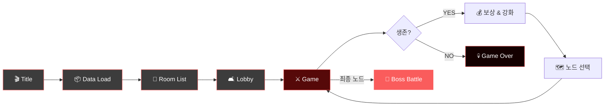

<div align="center">


# 🧟 ZIPPERS

### *Co-op Zombie Survival Action in a Ruined City*

**Survive. Upgrade. Push Forward.**

[](https://unity.com/)
[]()
[]()
[]()
[]()

[**🎮 Play on itch.io**](https://devel-rocket.itch.io/zippers) · [**📥 Download**](https://devel-rocket.itch.io/zippers) · [**🐛 Report Bug**](../../issues)

</div>

---

## 📖 게임 소개

> 좀비 아포칼립스로 붕괴된 도시. 살아남은 이들에게 남은 것은 서로뿐이다.

**Zippers**는 좀비 아포칼립스로 붕괴된 도시를 배경으로 한 **1-4인 협동 로그라이크 슈팅 게임**입니다.

플레이어는 서로 다른 전투 역할을 가진 생존자가 되어 몰려오는 좀비 웨이브를 막아내고, 전투 보상으로 캐릭터를 강화하며 다음 전투 노드로 나아가야 합니다. 제한된 자원, 점점 강해지는 좀비, 그리고 팀원 간의 역할 분담이 생존의 핵심입니다.

**끝까지 살아남아 최종 보스 전투에 도달하세요.**

---

## ⚔️ 핵심 특징

<table>
<tr>
<td width="50%" valign="top">

### 🧟 좀비 아포칼립스
붕괴된 도시를 배경으로 한 몰입감 있는 3D 액션 전투

</td>
<td width="50%" valign="top">

### 🤝 1-4인 협동 플레이
Unity Netcode 기반의 안정적인 멀티플레이어 경험

</td>
</tr>
<tr>
<td width="50%" valign="top">

### 🎯 4종 클래스 시스템
근접 / 라이플 / 샷건 / 피스톨 — 서로 다른 전투 스타일

</td>
<td width="50%" valign="top">

### 🌊 웨이브 기반 전투
점점 강해지는 좀비 무리를 끝까지 막아내라

</td>
</tr>
<tr>
<td width="50%" valign="top">

### 🗺️ 노드 선택 진행
원하는 길을 선택하며 나아가는 로그라이크식 스테이지

</td>
<td width="50%" valign="top">

### 💰 팀 재화 & 상점
협동 성장을 위한 공유 재화 시스템과 업그레이드 상점

</td>
</tr>
</table>

---

## 🎭 클래스

> 각 클래스는 고유한 전투 스타일과 역할을 가집니다. 팀의 구성에 따라 전략이 달라집니다.

| 클래스 | 역할 | 전투 스타일 |
| :---: | :--- | :--- |
| 🗡️ **Melee** | 높은 체력과 근접 전투에 특화된 생존자 | 탱커 / 근접 딜러 |
| 🔫 **Rifle** | 안정적인 사거리와 연사력을 가진 원거리 전투원 | 메인 딜러 |
| 💥 **Shotgun** | 강력한 근거리 화력으로 무리를 정리하는 클래스 | 근중거리 폭딜 |
| 🎯 **Pistol** | 뛰어난 유틸 능력으로 팀원을 보조하는 클래스 | 서포터 / 유틸 |

> 클래스 프리팹은 `Assets/Resources/Player/Class/` 에서 관리됩니다.

---

## 🔁 게임플레이 흐름



**Core Loop**: 웨이브 방어 → 전투 보상 → 캐릭터 강화 → 노드 선택 → 다음 전투 → ... → 보스

---

## 🎮 조작법

<div align="center">

| 동작 | 키 |
| :---: | :---: |
| **이동 (Move)** | `W` `A` `S` `D` |
| **대시 (Sprint)** | `Left Shift` |
| **조준 (Aim)** | `Right Mouse Button` |
| **공격 (Attack)** | `Left Mouse Button` |
| **재장전 (Reload)** | `R` |

</div>

---

## 🛠️ 기술 스택

<div align="center">

| 분류 | 사용 기술 |
| :--- | :--- |
| **엔진** | Unity 6 (6000.3.9f1) + URP 17.3 |
| **네트워킹** | Unity Netcode for GameObjects 2.11 |
| **매치메이킹** | Unity Services Multiplayer (Relay / Lobby) |
| **입력** | Unity Input System |
| **AI** | Unity AI Navigation |
| **데이터** | Newtonsoft JSON + Custom Data Pipeline |

</div>

---

## 👥 개발팀 — Devel Rocket 🚀

> 3주간의 짧지만 뜨거웠던 협업, **6인의 개발자**가 만든 게임입니다.

| 이름 | 담당 |
| :---: | :--- |
| **박승훈** | 기획 · UI/시스템 · 에셋 관리 · 밸런스 · PM · 통합 |
| **최완용** | 플레이어 · 전투 · 클래스 |
| **조경민** | 몬스터 · 웨이브 · 보스 |
| **김영찬** | 맵 · 노드 · 이벤트 |
| **제갈도원** | UI · 로비 |
| **이수형** | 데이터 시스템 · 네트워크 아키텍처 |

---

## 담당 업무
### 1. 좀비

**1-1.** **구현 목표**

- 좀비가 플레이어를 탐색하고 추적하며, 공격·피격·사망 상태에 따라 자연스럽게 행동하도록 AI 시스템을 구현했다. 또한 좀비 종류별로 서로 다른 공격 방식을 적용하고, 전투 노드 진행에 따라 능력치와 보상이 증가하도록 구성했다.

**1-2. 구현 방법**

- **상태 패턴 적용**
    - 좀비 행동을 추적, 공격, 피격, 사망 상태로 분리하여 각 상태별 로직을 독립적으로 구현하였다.
    - `StateMachine`이 현재 상태를 관리하고 조건에 따라 상태를 전환하도록 구성하였다.
- **플레이어 탐색 및 추적**
    - 일정 주기로 가장 가까운 플레이어를 탐색하여 목표를 갱신한다.
    - `NavMeshAgent`를 이용해 플레이어를 추적하고 공격 범위에 진입하면 공격 상태로 전환한다.
- **공격 방식 분리**
    - `IZombieAttack` 인터페이스를 사용하여 일반, 원거리, 보스 좀비의 공격 방식을 각각 구현하였다.
    - 애니메이션 이벤트를 이용해 실제 공격 판정과 애니메이션 타이밍을 일치시켰다.

**1-3. 설계 의도**

- 상태별 로직을 분리하여 코드의 유지보수성과 확장성을 높이고, 새로운 상태를 쉽게 추가할 수 있도록 하였다.
- 직접 경로 탐색을 구현하는 대신 `NavMeshAgent`에 맡겨 추적 로직을 단순화하도록 설계하였다.
- `IZombieAttack` 인터페이스를 사용하여 좀비 종류별 공격 방식을 독립적으로 구현하고, 새로운 공격 타입을 쉽게 추가할 수 있도록 하였다.

**1-4. 결과**

- 상태별 기능과 공격 방식을 독립적으로 관리할 수 있어 유지보수성과 확장성을 높일 수 있었다.
- `NavMeshAgent`를 활용하여 안정적인 플레이어 추적을 구현하고 이동 로직을 단순화할 수 있었다.

**1-5. 회고**

- 현재는 상태 패턴으로 좀비의 행동을 구현했지만, 추후 행동과 판단 조건이 다양해진다면 행동 트리를 적용하여 복잡한 AI 행동을 체계적으로 관리하는 방법도 시도해보고 싶다.

<br>

### 2. 웨이브

**2-1.** **구현 목표**

- 전투 노드마다 설정된 웨이브 데이터를 순서대로 실행하고, 각 웨이브의 좀비 생성과 종료 조건을 관리하는 시스템을 구현했다. 또한 모든 웨이브와 남은 좀비 처치가 완료되면 전투 노드가 정상적으로 클리어되도록 구성했다.

**2-2. 구현 방법**

- **웨이브 진행 관리**
    - `WaveManager`가 웨이브 시작, 종료, 다음 웨이브 진행 및 노드 클리어를 관리하도록 구현하였다.
- **코루틴 기반 웨이브 진행**
    - 코루틴을 이용하여 웨이브 시작 지연, 좀비 생성 간격, 다음 웨이브 대기 시간을 순차적으로 처리하였다.
    - 각 스폰 그룹을 순서대로 실행하여 설정된 생성 패턴에 맞게 좀비가 생성되도록 구현하였다.
- **좀비 생성 관리**
    - `NavMesh.SamplePosition`을 이용하여 이동 가능한 위치에서만 생성하도록 처리하였다.
- **오브젝트 풀링**
    - `PoolManager`를 구현하여 좀비, 투사체, 보상 오브젝트를 재사용하도록 구성하였다.
    - Queue 기반으로 반환된 오브젝트를 재사용하고, 필요한 경우에만 새로운 오브젝트를 생성하도록 구현하였다.

**2-3. 설계 의도**

- 시간에 따라 순차적으로 진행되는 웨이브 특성을 고려하여 코루틴을 사용해 진행 흐름을 직관적으로 관리할 수 있도록 설계하였다.
- 좀비가 이동 불가능한 위치에 생성되는 문제를 해결하기 위해 `NavMesh.SamplePosition`을 활용하여 이동 가능한 위치에서만 좀비가 생성되도록 하였다.
- 오브젝트를 반복 생성·삭제하는 대신 재사용하여 메모리 할당과 GC 발생을 줄이고 성능을 향상시키도록 설계하였다.

**2-4. 결과**

- 웨이브 진행 흐름을 순차적으로 처리하여 생성 타이밍을 안정적으로 제어할 수 있었다.
- 이동 불가능한 위치에 좀비가 생성되는 문제를 해결하여 모든 좀비가 정상적으로 이동하도록 개선하였다.
- 오브젝트 풀링을 적용하여 반복적인 생성과 삭제를 줄였으며, 이후 투사체와 보상 오브젝트에도 동일한 구조를 재활용하였다.

**2-5. 회고**

- 현재는 생성 시 `NavMesh.SamplePosition`으로 스폰 위치를 보정하고 있지만, 추후에는 맵 로드 시 스폰 포인트를 미리 검증하고 유효한 위치로 보정하여 생성 과정을 단순화해보고 싶다.

---

## 🚀 실행 방법

### 📥 빌드된 게임 플레이하기

가장 빠른 방법은 itch.io에서 바로 다운로드하는 것입니다.

```
👉 https://devel-rocket.itch.io/zippers
```

1. 위 링크에서 `Zippers.zip` (215 MB) 다운로드
2. 압축 해제
3. `Zippers.exe` 실행
4. 방을 만들거나 친구의 방에 참가하여 플레이!

### 🧩 소스에서 빌드하기

```bash
# 저장소 클론
git clone https://github.com/<your-org>/Zippers_NetworkProject.git
cd Zippers_NetworkProject/Zippers
```

1. **Unity Hub**에서 `Zippers` 폴더를 프로젝트로 열기 (Unity `6000.3.9f1` 필요)
2. 첫 실행 시 패키지 자동 복원 대기
3. `Assets/Scenes/TitleScene` 을 열고 Play

---

## 🏷️ 태그

`#3D` `#Co-op` `#Multiplayer` `#Roguelike` `#Shooter` `#Survival` `#Zombies` `#Post-apocalyptic` `#Unity` `#Indie`

---

<div align="center">

### 🧟‍♂️ Survive. Upgrade. Push Forward. 🧟‍♀️

**Built with Unity · Made by Devel Rocket · 2026**

[](https://devel-rocket.itch.io/zippers)

> *이 게임은 팀 프로젝트로 제작된 개발 버전입니다.*
> *일부 기능, 밸런스, UI, 네트워크 동작은 추후 변경될 수 있습니다.*

<sub>[](https://classroom.github.com/online_ide?assignment_repo_id=23689530&assignment_repo_type=AssignmentRepo)</sub>

</div>
